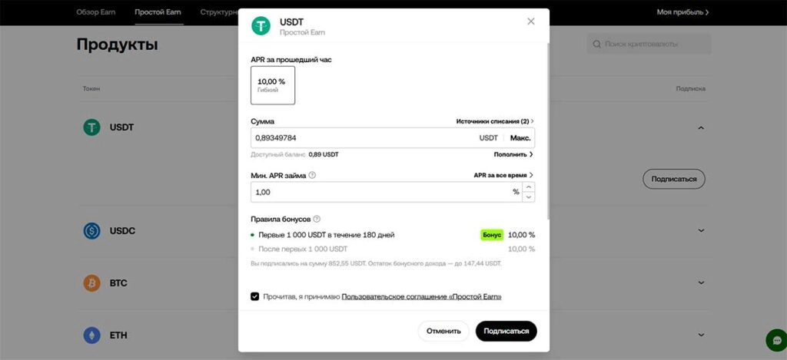

# Simple Earn on OKX: How I'm Making 10%+ Annual Returns in Crypto (Stress-Free)

Ever wondered how to earn decent returns on crypto without constantly monitoring charts or learning complex trading strategies? Let me show you what's been working for me—and why it's way easier than you'd think.

---

I'm pulling in over 10% annually in dollar-denominated returns on OKX using something called "Simple Earn." No fancy trading required. No analyzing charts at 3 AM. Just... passive income. The boring kind that actually works.

Here's what caught my attention: while traditional banks offer 3-5% on dollar deposits (after jumping through regulatory hoops), I'm getting double that—sometimes triple—just by understanding one straightforward product. And honestly? I wish someone had explained this to me when I first dipped my toes into crypto, instead of all those generic referral-chasing posts that were everywhere.

---

Let me start with some real numbers. Right now, with $852 invested in USDT (that's Tether—basically crypto's version of the dollar), I'm earning this much daily. Completely passive. No active trading, no watching the markets, nothing.

And that's just one slice of my portfolio on this exchange. I've got similar setups running in USDC, ETH, TRX, and a few others, but let's keep things simple for now. Walking before running, you know?

Yeah, the daily amount might not sound life-changing. But here's the thing: it compounds. It's in dollars (well, USDT). And it requires literally zero effort once you set it up.

Compare that to opening an investment account at a traditional broker—which I did this year with Interactive Brokers, so I know the pain firsthand. The paperwork, the proof of income, the waiting. With OKX? You sign up and you're essentially good to go.

👉 [Want to see how this actually works for yourself? Start earning passive returns here](https://www.okx.com/join/47044926)

## What Actually Is OKX Earn?

OKX Earn isn't just one thing—it's got three main branches:

1. **Simple Earn** (the passive one we're focusing on)
2. **Structured Products** (more active trading stuff)
3. **On-Chain Earn** (DeFi contracts and protocols)

Some require your attention. Others don't. Today we're talking about the "set it and forget it" option—Simple Earn.

Think of Simple Earn like a crypto savings account. You deposit USDT, USDC, Bitcoin, ETH, or whatever, and you get annual percentage yields. Similar concept to traditional banking, but with better rates. Much better rates.

Now, someone always brings up risk at this point. "But banks are safer!" Look, OKX has been around since 2017. It's in the top 3 global crypto exchanges for derivatives trading, sitting right alongside Binance and Bybit. They're not some fly-by-night operation.

They're heavily regulated too—so much so that they don't even offer ruble P2P trading anymore. Your funds are under the watchful eye of multiple regulators. Not saying it's risk-free (nothing is), but the risk profile isn't as wild as people assume.

### Where Does the Profit Come From?

Good question. Two main sources:

**Margin traders**: People trading with leverage need to borrow liquidity. That liquidity comes from Simple Earn deposits. They pay interest for that privilege. You get a cut.

**Loan borrowers**: Users can take out loans using their crypto as collateral. The collateral always exceeds the loan amount. The interest on these loans? Also goes to Simple Earn participants (that's you).

So you're essentially acting as the bank, lending to traders and borrowers. OKX handles all the infrastructure and risk management. You just collect the yield.

## How to Actually Do This: Step-by-Step

Alright, enough theory. Here's how to start earning:

**Step 1**: Register on okx.com and deposit funds. Start small if you want—even $10 works to test the waters.

**Step 2**: Navigate to the "Earn" section, then click into "Simple Earn."

**Step 3**: Select USDT from the product list. USDT is pegged to the US dollar, making it the most stable option for most people. It's what most crypto transactions are denominated in anyway.

**Step 4**: Hit "Subscribe" and configure your settings:

- **Amount**: How much you want to invest. Unlike traditional banks, there's no lock-up period. Withdraw whenever you want.
- **Debit Source**: Choose whether funds come from your main account or trading account.
- **Min. Loan APR**: The lowest annual rate you're willing to accept. I recommend setting this to 1%—not because you'll earn 1%, but because it's a reasonable floor that keeps your funds working most of the time.
- **Bonus Rules**: Extra incentives. Since USDT is crucial for trading pairs, OKX often throws in bonuses for USDT deposits.

**Step 5**: Confirm by clicking "Subscribe" again. Done. Your money is now working for you.

### What About Other Cryptocurrencies?

If you sort the Simple Earn table by market APR, you'll notice some cryptocurrencies offering way more than 10% annually. Sometimes you'll see rates like 86%, 74%, or 49%.

Right now I could throw money into T, FLR, or DGB at those crazy rates. But here's what you need to know:

1. **Price volatility is real**: That $100 you invest today could be $5 tomorrow. Or $5,000. Who knows? When the underlying asset swings that much, the APR becomes less meaningful.

2. **APR fluctuates dramatically**: Those 86% annual rates might only last a day or two before dropping to 1%. Always check the "Historical APR" tab before committing.

See those charts? USDT (left) shows steady, predictable returns. DGB (right) is all over the place. Over the long run, USDT's consistency wins by 3x despite lower nominal rates. Choose wisely.

---

## The Bottom Line

For the next few years, I'm sticking with Simple Earn on OKX for my passive crypto holdings. I'm focusing on products with bonus incentives right now, then I'll probably diversify across a few more platforms.

I'm also experimenting with other coins and testing out trading bots for short-term plays. But that's a story for another day.

👉 [If you're curious about earning passive returns like this, check out Simple Earn for yourself](https://www.okx.com/join/47044926)

The beauty of Simple Earn is how stupidly simple it actually is. No PhD in economics required. No staying up late watching charts. Just consistent returns with less drama than you'd expect. And in this space? That's genuinely refreshing.
